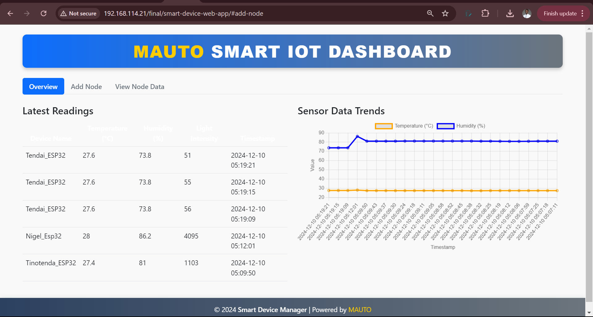
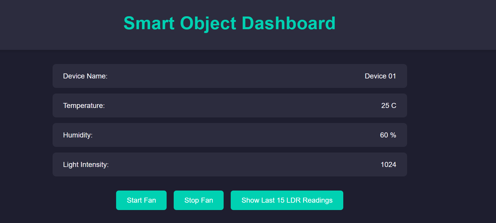

```markdown
# MAUTO Smart IoT Dashboard

A comprehensive IoT system for monitoring environmental data with sensor nodes and a web-based dashboard.
````


```
## Features

### Sensor Node (ESP32)
- 🌡️ Real-time temperature/humidity monitoring (DHT22 sensor)
- 💡 Light intensity detection (LDR sensor)
- 🌀 Automatic/manual fan control via relay
- 📶 Dual communication protocols (HTTP/MQTT)
- 📺 Local LCD display & IP configuration
- ⚙️ Web-based configuration interface
- 🔄 Over-the-Air (OTA) firmware updates

### Backend System
- 🗃️ MySQL database storage
- 🔄 REST API for data handling (PHP)
- 📡 MQTT message broker integration

### Web Dashboard
- 📊 Real-time data visualization (Chart.js)
- 📍 Node management system
- 📱 Responsive Bootstrap design
- 🔍 Historical data exploration
- 📅 Time-series data tracking

## Hardware Requirements

### Sensor Node Components
| Component       | Quantity |
|-----------------|----------|
| ESP32 Dev Board | 1        |
| DHT22 Sensor    | 1        |
| LDR Sensor      | 1        |
| 16x2 LCD        | 1        |
| Relay Module    | 1        |
| Breadboard      | 1        |
| Jumper Wires    | 15+      |

## Installation

### Database Setup
1. Create MySQL database:
   ```sql
   CREATE DATABASE iot_project;
   ```
2. Create tables:
   ```sql
   CREATE TABLE smartdevices (
     DeviceID INT PRIMARY KEY,
     DeviceName VARCHAR(255),
     DLocation VARCHAR(255)
   );
   
   CREATE TABLE sensorreadings (
     ReadingID INT AUTO_INCREMENT PRIMARY KEY,
     DeviceID INT,
     Temperature DECIMAL(5,2),
     Humidity DECIMAL(5,2),
     LightIntensity INT,
     Timestamp TIMESTAMP DEFAULT CURRENT_TIMESTAMP,
     FOREIGN KEY (DeviceID) REFERENCES smartdevices(DeviceID)
   );
   ```

### Dashboard Setup
1. Clone repository:
   ```bash
   git clone https://github.com/yourrepo/mauto-iot.git
   ```
2. Configure database connection in `connection.php`:
   ```php
   $SERVER = 'localhost';
   $USERNAME = 'your_username';
   $PASSWORD = 'your_password';
   $DB_NAME = 'iot_project';
   ```

### ESP32 Configuration
1. Install required libraries:
   - LiquidCrystal_PCF8574
   - DHT sensor library
   - PubSubClient (for MQTT)
2. Update credentials in `mauto-iot.ino`:
   ```cpp
   const char* ssid = "YOUR_WIFI_SSID";
   const char* password = "YOUR_WIFI_PASSWORD";
   const char* mqttServer = "YOUR_MQTT_BROKER_IP";
   ```

## Usage

### Sensor Node Web Interface
1. Connect to ESP32 AP
2. Access `http://<ESP_IP>/config`
3. Configure parameters:
   - Device Name/Location
   - Communication Protocol
   - Fan Control Mode
   - Temperature Threshold



### Dashboard Features
- **Overview Tab**: Real-time sensor readings
- **Add Node**: Register new IoT devices
- **View Data**: Historical data visualization

```javascript
// Sample API Call
fetch('http://your-server/smart_object_api.php')
  .then(response => response.json())
  .then(data => updateDashboard(data));
```

## API Documentation

### Endpoints
- `GET /smart_object_api.php` - Retrieve sensor data
- `POST /smart_object_api.php` - Submit new readings

### Sample Request
```bash
curl -X POST -H "Content-Type: application/json" \
  -d '{"deviceID":1,"Temperature":25.5,"Humidity":60,"LightIntensity":850}' \
  http://your-server/smart_object_api.php
```

## Troubleshooting

| Issue                  | Solution                          |
|------------------------|-----------------------------------|
| No WiFi Connection     | Check ESP32 power cycle           |
| Missing Data           | Verify MQTT broker connection     |
| Dashboard Errors       | Check PHP error logs              |
| Sensor Inaccuracies    | Calibrate DHT22 sensor            |

## License
MIT License - See [LICENSE](LICENSE) for details

